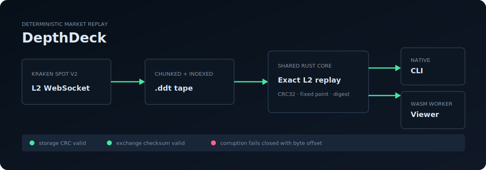
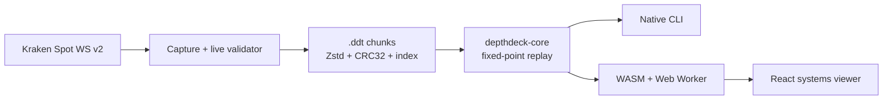

# DepthDeck

[](https://github.com/ericskavinski/depthdeck/actions/workflows/ci.yml)
[](https://ericskavinski.github.io/depthdeck/)
[](#license)

**A deterministic flight recorder and replay engine for Kraken Spot v2 L2 order books.**

[Open the interactive WASM viewer](https://ericskavinski.github.io/depthdeck/) · [Read the tape format](docs/tape-format.md) · [See the architecture](docs/architecture.md)



DepthDeck captures raw WebSocket messages with their monotonic receive time, validates Kraken's CRC32 book checksum as data arrives, and stores the stream in a compressed, independently checksummed `.ddt` tape. The same Rust replay core powers both the CLI and the browser viewer through WebAssembly.

This project deliberately goes one exchange deep. It is an observability and replay system—not a trading engine, strategy backtester, or multi-venue abstraction.

## What it demonstrates

- Loss-aware WebSocket capture with reconnect markers and snapshot resynchronization.
- Exact fixed-point decimal handling; book state never passes through floating point.
- Transactional updates: a bad exchange checksum cannot publish a corrupt book.
- A versioned, chunked tape with Zstandard compression, per-chunk CRC32, and a footer index.
- Deterministic replay, seek, state digests, NDJSON export, and corruption diagnostics with byte offsets.
- One portable Rust core compiled natively and to WebAssembly, with replay isolated in a Web Worker.
- Deterministic synthetic data for tests and the public demo; no captured market data is committed.

## Quick start

Requirements: Rust 1.90+ and, for the viewer, Node.js 24+, the `wasm32-unknown-unknown` target, and `wasm-bindgen-cli` 0.2.126.

```sh
git clone https://github.com/ericskavinski/depthdeck.git
cd depthdeck
cargo run -p depthdeck -- inspect web/public/demo.ddt
cargo run -p depthdeck -- verify web/public/demo.ddt
cargo run --release -p depthdeck -- replay web/public/demo.ddt --speed max --emit snapshots
```

Capture a live Kraken book:

```sh
cargo run --release -p depthdeck -- capture \
  --symbol BTC/USD \
  --depth 100 \
  --duration 30s \
  --output btc-usd.ddt

cargo run --release -p depthdeck -- verify btc-usd.ddt
```

Depth must be one of Kraken's supported values: `10`, `25`, `100`, `500`, or `1000`. Capture writes to `OUTPUT.part`, flushes and syncs the completed tape, then renames it atomically. Existing outputs are preserved unless `--force` is passed.

Run the viewer locally:

```sh
rustup target add wasm32-unknown-unknown
cargo install wasm-bindgen-cli --version 0.2.126 --locked
cd web
npm ci
npm run dev
```

## CLI

| Command | Purpose |
| --- | --- |
| `capture` | Record and live-validate a Kraken Spot v2 book. |
| `inspect` | Show metadata, duration, chunk count, size, and compression. |
| `verify` | Decode every chunk and replay every book checksum. |
| `replay` | Replay on the receive clock at `0.1`, `1`, `10`, or `max` speed. |
| `export` | Write raw records and timing metadata as NDJSON. |
| `bench` | Measure maximum-speed deterministic replay. |

`inspect`, `verify`, and `bench` support `--json` for automation. Run `depthdeck <command> --help` for every option.

## Architecture



The replay boundary is intentionally narrow: `TapeReader` validates storage integrity, while `ReplaySession` owns time, synchronization state, book mutation, checksum verification, seeking, and deterministic state digests. See [the architecture notes](docs/architecture.md) for the trade-offs.

## Performance

`depthdeck bench` includes JSON decoding, fixed-point conversion, transactional book mutation, sorting, and a Kraken checksum on every message. On the development Windows workstation, the synthetic workload replays at roughly **220k fully verified messages/second** (release build), and midpoint seek on the 90-second demo takes about **17 ms**. Treat these as reproducible baselines, not universal claims:

```sh
cargo run --release -p depthdeck -- bench --iterations 20 --json
```

The benchmark also reports midpoint seek latency and the deterministic end-state digest, so performance changes cannot silently skip replay work.

## Data and safety

The checked-in `web/public/demo.ddt` is generated from a fixed seed and contains no market data. Your own capture files are ignored by Git by default. Kraken access and redistribution remain subject to Kraken's terms and the rules in your jurisdiction. DepthDeck has no order-entry path and should not be used as a source of trading or investment advice.

## Development

```sh
cargo fmt --all -- --check
cargo clippy --workspace --all-targets -- -D warnings
cargo test --workspace
cd web && npm ci && npm test && npm run typecheck && npm run build
```

Release tags matching `v*` build native archives for Linux, macOS, and Windows, generate SHA-256 checksums, and draft a GitHub Release. GitHub Pages is built from the same deterministic tape and WASM core.

## License

Licensed under either of [Apache License, Version 2.0](LICENSE-APACHE) or [MIT](LICENSE-MIT), at your option.
